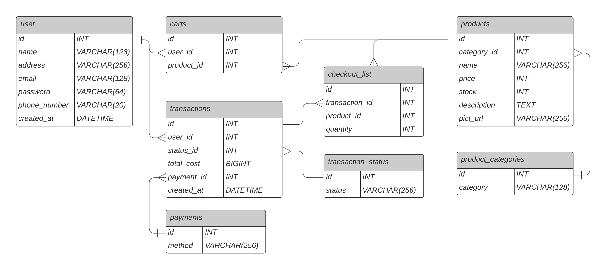

# Go Backend API App

This is a Go backend API app that provides the MVP of an online store app. Developed using Go Echo and MySQL as RDBMS.

## Setup Instructions

Follow these steps to set up and run the application:

1. Clone the repository:

   ```shell
   git clone https://github.com/sultanfariz/synapsis-assignment.git
   ```

2. Navigate to the project directory:
```cd synapsis-assignment```

3. Build the Docker image:
```docker build -t sultanfariz/synapsis-assignment:1.0.0 .```

4. Run the Docker container:
```docker run -p 8080:8080 go-backend-api```

5. The API will be accessible at http://localhost:8080.

## Diagram


## API Docs
API documentation is available on SwaggerHub:
https://app.swaggerhub.com/apis-docs/sultanfariz/synapsis-assignment/1.0.0
